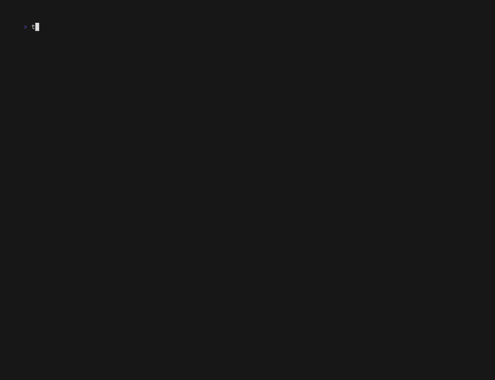

<div align="center" style="width: 100%;">
 
</div>

# TCPING

[](https://goreportcard.com/report/github.com/pouriyajamshidi/tcping)
[](https://www.codefactor.io/repository/github/pouriyajamshidi/tcping)
[](https://github.com/pouriyajamshidi/tcping/actions/workflows/go.yml)
[](https://github.com/pouriyajamshidi/tcping/actions/workflows/container-publish.yml)

[](https://badge.fury.io/go/github.com%2Fpouriyajamshidi%2Ftcping)


A cross-platform ping program for `TCP` ports inspired by the Linux's ping utility. This program will send `TCP` probes to an `IP address` or a `hostname` specified by you and prints the results. It supports both `IPv4` and `IPv6`.

**TCPING** uses different `TCP sequence numbering` for _successful_ and _unsuccessful_ probes, so that when you look at the results and spot a failed probe, inferring the total packet drops to that point would be easy.

Here are some of the features of **TCPING**:

- An alternative to `ping` in environments that `ICMP` is blocked.
- Monitor your network connection.
- Determine packet loss.
- Analyze the network's latency.
- Calculate `minimum`, `average` and `maximum` latency of network probes.
- Print connection statistics by pressing the `Enter` key, without stopping the program.
- Retry hostname resolution after a predetermined number of probe failures by using the `-r` flag . Suitable to test your `DNS` load balancing or Global Server Load Balancer `(GSLB)`.
- Enforce using `IPv4` or `IPv6`.
- Display the longest encountered `downtime` and `uptime` duration and time.
- Monitor and audit your peers network (SLA).
- Calculate the total uptime or downtime of your network when conducting a maintenance.

---

## Table of Contents

- [TCPING](#tcping)
  - [Table of Contents](#table-of-contents)
  - [Demos](#demos)
    - [Basic usage](#basic-usage)
    - [Retry hostname lookup (`-r`) flag](#retry-hostname-lookup--r-flag)
    - [JSON output (`-j --pretty`) flag](#json-output--j---pretty-flag)
  - [Usage](#usage)
    - [On `Linux` and `macOS`](#on-linux-and-macos)
    - [On `Windows`](#on-windows)
    - [Using Docker](#using-docker)
  - [Download](#download)
  - [Flags](#flags)
  - [Tips](#tips)
  - [Notes](#notes)
  - [Contributing](#contributing)
  - [Feature Requests and Issues](#feature-requests-and-issues)
  - [Tested on](#tested-on)
  - [Sponsor The Project](#sponsor-the-project)
  - [License](#license)

---

## Demos

### Basic usage


---

### Retry hostname lookup (`-r`) flag


---

### JSON output (`-j --pretty`) flag



---

## Usage

Download TCPING for your operating system [here](#download), extract it. Then, follow the instructions below:

- [Linux and macOS](#on-linux-and-macos)
- [Windows](#on-windows)
- [Docker images](#using-docker)

Also check the [available flags here](#flags).

### On `Linux` and `macOS`

Extract the file:

```bash
tar -xvf tcping_Linux.tar.gz
#
# Or on Mac OS
#
tar -xvf tcping_MacOS.tar.gz
#
# on Mac OS ARM
#
tar -xvf tcping_MacOS_ARM.tar.gz
```

Make the file executable:

```bash
chmod +x tcping
```

Copy the executable to your system `PATH` like `/usr/local/bin/`:

```bash
sudo cp tcping /usr/local/bin/
```

Run it like:

```bash
tcping www.example.com 443
# Or
tcping 10.10.10.1 22
```

### On `Windows`

We recommend [Windows Terminal](https://apps.microsoft.com/store/detail/windows-terminal/9N0DX20HK701) for the best experience and proper colorization.

Copy `tcping.exe` to your system [PATH](https://www.howtogeek.com/118594/how-to-edit-your-system-path-for-easy-command-line-access/) like `C:\Windows\System32` and run it like:

```powershell
tcping www.example.com 443
# Or provide the -r flag to
# enable name resolution retries after a certain number of failures:
tcping www.example.com 443 -r 10
```

### Using Docker

The Docker image can be used like:

```bash
# Using Docker Hub
docker run -it pouriyajamshidi/tcping:latest example.com 443

# Using GitHub container registry:
docker run -it ghcr.io/pouriyajamshidi/tcping:latest example.com 443
```

---

## Download

- ### [Windows](https://github.com/pouriyajamshidi/tcping/releases/latest/download/tcping_Windows.zip)

- ### [Linux](https://github.com/pouriyajamshidi/tcping/releases/latest/download/tcping_Linux.tar.gz) - Also available through `brew`

- ### [macOS](https://github.com/pouriyajamshidi/tcping/releases/latest/download/tcping_MacOS.tar.gz) - Also available through `brew`

- ### [macOS M1 - ARM](https://github.com/pouriyajamshidi/tcping/releases/latest/download/tcping_MacOS_ARM.tar.gz) - Also available through `brew`

When the download is complete, head to the [usage](#usage) section.

**Alternatively**, you can:

- Use the `Docker` images:

  ```bash
  docker pull pouriyajamshidi/tcping:latest
  ```

  > Image is also available on GitHub container registry:

  ```bash
  docker pull ghcr.io/pouriyajamshidi/tcping:latest
  ```

- Install using `go install`:

  ```bash
  go install github.com/pouriyajamshidi/tcping@latest
  ```

- Install using `brew`:

  ```bash
  brew install pouriyajamshidi/tap/tcping
  ```

- Or compile the code yourself by running the `make` command in the `tcping` directory:

  ```bash
  make build
  ```

  This will give you a compressed file with executables for all the supported operating systems inside the `executables` folder.

---

## Flags

The following flags are available to control the behavior of application:

| Flag       | Description                                                                                                               |
| ---------- | ------------------------------------------------------------------------------------------------------------------------- |
| `-4`       | Only use IPv4 addresses                                                                                                   |
| `-6`       | Only use IPv6 addresses                                                                                                   |
| `-r`       | Retry resolving target's hostname after `<n>` number of failed probes. e.g. -r 10 to retry after 10 failed probes         |
| `-c`       | Stop after `<n>` probes, regardless of the result. By default, no limit will be applied  (available from version `v1.23`) |
| `-j`       | Output in `JSON` format                                                                                                   |
| `--pretty` | Prettify the `JSON` output                                                                                                |
| `-v`       | Print version                                                                                                             |
| `-u`       | Check for updates                                                                                                         |

> Without specifying the `-4` and `-6` flags, tcping will use one randomly based on DNS lookups.

---

## Tips

- Press the `Enter` key while the program is running to examine the summary of all probes without terminating the program, as shown in the [demos](#demos) section.

---

## Notes

`TCPING` is constantly being improved, adding numerous new features and fixing bugs. Be sure to look for updated versions.

```bash
tcping -u
```

## Contributing

Pull requests are welcome to solve bugs, add new features and also to help me with the open issues that can be found [here](https://github.com/pouriyajamshidi/tcping/issues)

Current number of open issues: .

1. Pick any issue that you feel comfortable with.
2. Fork the repository.
3. Create a branch.
4. Commit your work.
5. Add tests if possible.
6. Run the tests `go test` or `make test`.
7. Create a pull request

Please make sure that your pull request **only covers one specific issue** and doesn't handle two or more tickets. This makes it simpler for us to examine your pull request and helps keep the git history clean.

## Feature Requests and Issues

Should you need a new feature or find a bug, please feel free to [open a pull request](#contributing) or submit an issue.

## Tested on

Windows, Linux and macOS.

## Sponsor The Project

[](https://www.buymeacoffee.com/pouriyajamshidi)  
[](https://github.com/sponsors/pouriyajamshidi)  


## License

[](https://opensource.org/licenses/MIT)
