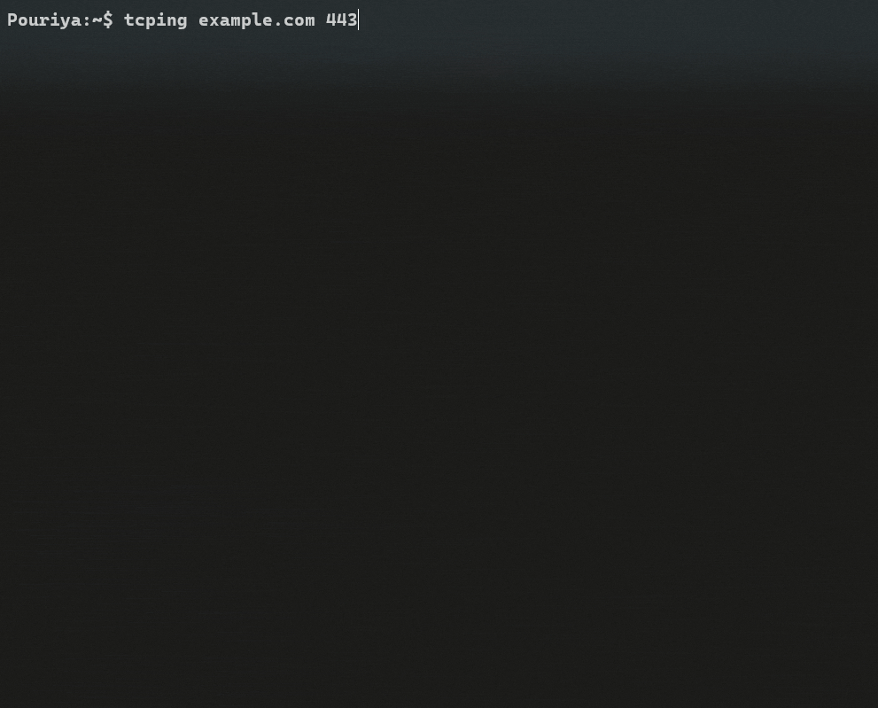

# TCPING

[](https://goreportcard.com/report/github.com/pouriyajamshidi/tcping)

A cross-platform ping program for `TCP` ports inspired by the Linux's ping utility. This program will send `TCP` probes to an `IP address` or a `hostname` specified by you and prints the result. It works with both `IPv4` and `IPv6`.

TCPING uses different `TCP sequence numbering` for successful and unsuccessful probes, so that when you look at the results and spot a failed probe, understanding the total packet drops to that point would be illustrative enough.

## Features And Application

- Monitor your network connection.
- Calculate packet loss.
- Assess the latency of your network.
- Show `min`/`avg`/`max` probes latency.
- Retry resolving a hostname after a certain number of ping failures by using the `-r` flag. This option is useful if you are testing your Global Server Load Balancer (GSLB) or DNS load balancing.
- Print connection statistics on `Enter` key press.
- Display the longest encountered downtime and uptime duration and time.
- Monitor and audit your peers network.
- Calculate the total uptime/downtime when conducting a maintenance.
- An alternative to `ping` in environments that `ICMP` is blocked.

## Demos

### Vanilla usage



---

### Retry resolve (`-r`) in action


## Download the executables for

- ### [Windows](https://github.com/pouriyajamshidi/tcping/releases/latest/download/tcping_Windows.zip)

- ### [Linux](https://github.com/pouriyajamshidi/tcping/releases/latest/download/tcping_Linux.zip)

- ### [macOS](https://github.com/pouriyajamshidi/tcping/releases/latest/download/tcping_MacOS.zip)

In addition to downloading the executables, you can install it using `go get` or `make` command:

- Install it using `go get`:

  ```bash
  go get github.com/pouriyajamshidi/tcping
  ```

- Or compile the code yourself by running the `make` command inside the cloned directory:

  ```bash
  make build
  ```

## Usage

If you have downloaded the executable, go to the directory/folder in which you have downloaded the application and extract the compressed file.

### On `Linux` and `macOS`

```bash
chmod +x tcping
```

For easier use, you can copy it to your system `PATH` like `/bin/` or `/usr/bin/`:

```bash
cp tcping /usr/bin/
```

Then run it like, `tcping <hostname/IP address> <port>`. For instance:

```bash
tcping www.example.com 443

# OR

tcping 10.10.10.1 22
```

Specifying the `-r` option will cause a name resolution retry after a certain number of failures. For instance:

```bash
tcping www.example.com 443 -r 10
# OR
tcping -r 10 www.example.com 443
```

will result in a retry of name resolution after 10 probe failures.

### On `Windows`

I recommend `Windows Terminal` for the best experience and proper colorization.

For easier use, copy `tcping.exe` to your system `PATH` like `C:\Windows\System32` and run it like:

```powershell
tcping www.example.com 443

# OR provide the -r flag to
# enable name resolution retries after a certain number of failures:
tcping www.example.com 443 -r 10
```

or from your terminal application, go to the folder that contains the `tcping.exe` program and run:

```powershell
.\tcping.exe 10.10.10.1 22
```

**Please note, if you copy the program to your system `PATH`, you don't need to specify `.\` and the `.exe` extension to run the program anymore.**

## Tips

- While the program is running, press the `Enter` key to view the summary of all probes without exiting the program as depicted in the [demos](#Demos) section.
- Specifying the `-r` flag followed by a number, for instance, 3, will retry resolving a hostname after 3 tcp probe failures.

## Notes

TCPING is being constantly worked on and receives many new features and fixes. Make sure to check for newer versions.

## Contributing

Pull requests are welcome to solve bugs, add new features and also to help me with the open issues that can be found here .

1. Pick any issue that you feel comfortable with.
2. Fork the repository.
3. Create a branch.
4. Commit your work.
5. Add tests if possible.
6. Run the tests `go test` or `make test`.
7. Create a pull request

Please make sure to only work on a specific issue on your pull request and not address two or more tickets in one PR. This will help me to review your pull request easier and also contributes to a cleaner git history.

## Tested on

Windows, Linux and macOS.

## Sponsor us

[](https://www.buymeacoffee.com/pouriyajamshidi)  
[](https://github.com/sponsors/poruyajamshidi)  


## License

[](https://opensource.org/licenses/MIT)
